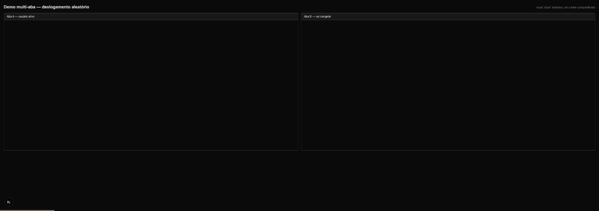

# assaad-auth-lab

**Desafio prático — Engenheiro(a) Frontend Sênior, Plataforma Assaad.**
Eliminar o deslogamento aleatório num app Next.js (App Router) + Supabase
com sessão por cookie (SSR), pela ótica do frontend.

Método: em vez de aplicar a correção de fé, este repositório **constrói o
bug de propósito, confirma a causa-raiz com dados e só então corrige** —
cada fase é um PR:

| Fase | PR | O quê |
|---|---|---|
| 1 | [#1](https://github.com/mateusdeve/assaad-auth-lab/pull/1) | App autenticado ingênuo com o bug plantado ([docs/fase-1.md](docs/fase-1.md)) |
| 2 | [#2](https://github.com/mateusdeve/assaad-auth-lab/pull/2) | Instrumentação + causa-raiz confirmada com dados ([docs/fase-2.md](docs/fase-2.md)) |
| 3 | [#3](https://github.com/mateusdeve/assaad-auth-lab/pull/3) | Demonstração multi-aba do bug ([docs/fase-3.md](docs/fase-3.md)) |
| 4 | [#4](https://github.com/mateusdeve/assaad-auth-lab/pull/4) | Correção em 3 camadas + validação ([docs/fase-4.md](docs/fase-4.md)) |

**Parte 1 (teórica):** respostas às 6 questões em
[docs/parte-1-teorica.md](docs/parte-1-teorica.md).

## A causa-raiz (pela ótica do front)

O GoTrue rotaciona refresh tokens: cada um é **de uso único** e renovar
devolve um par novo. O deslogamento aleatório nasce quando alguma cópia do
token fica para trás. A cadeia, confirmada com instrumentação
(`docs/fase-2.md`):

1. **Rotação perdida no SSR.** Sem middleware/proxy, a renovação acontece
   dentro de um Server Component — onde o Next **descarta escrita de
   cookies** (o `try/catch` vazio da própria doc do @supabase/ssr engole a
   falha). O token novo se perde; o cookie do browser fica com o antigo, já
   consumido.
2. **Estado latente, não quebra imediata.** O GoTrue tem uma graça: reusar
   um token cujo filho nunca foi usado devolve o mesmo filho. O app
   "funciona" — pagando um refresh por requisição SSR — e o cookie nunca
   avança. Por isso o bug parece aleatório: a bomba fica armada sem
   sintoma.
3. **O gatilho.** Quando a cadeia avança de verdade (auto-refresh de outra
   aba consome o filho), qualquer ator ainda segurando o token velho — aba
   que congelou e acordou, request em voo, outro dispositivo — recebe
   `400 refresh_token_already_used`.
4. **O logout é auto-infligido.** Medimos: após o erro, o token bom
   **continuava válido** no GoTrue. Quem desloga é o cliente: o auth-js, na
   falha de refresh com access token vencido, **apaga o cookie
   compartilhado** — e derruba todas as abas de uma sessão recuperável.

Sintomas explicados: sem padrão de tempo (depende de quando a cadeia
avança), pior ao trocar de aba (atores defasados) e após inatividade
(expiração garantida + timers suspensos).

**Antes** (Fases 1–3): a aba congelada acorda e derruba todo mundo —



**Depois** (Fase 4): mesmo gesto, ninguém desloga —


## A correção (3 camadas)

### 1. `src/proxy.ts` — renovação que persiste *(requisito 1)*

Único ponto de refresh do fluxo SSR: reescreve o request (RSCs da própria
requisição enxergam a sessão nova) e devolve `Set-Cookie` (o browser avança
junto). Servidor e cliente nunca mais divergem por rotação perdida.
Adaptação Next 16: `proxy.ts`/`export proxy` no lugar do `middleware.ts`
que a doc do Supabase ainda ensina. **Autorização não mora aqui**
(CVE-2025-29927 provou que middleware é contornável): proteção de rota fica
no RSC, junto do dado, sempre com `getUser()` — nunca `getSession()` — no
servidor.

### 2. Guarda de escrita do cookie *(requisito 2 — coordenação entre abas)*

O supabase-js já traz single-flight de refresh, *commit guard* contra
TOCTOU e BroadcastChannel entre abas. O que faltava — e a Fase 3 filmou —
era impedir um ator defasado de corromper o cookie compartilhado. O browser
client usa `cookies: {getAll, setAll}` customizados que:

- bloqueiam **escrita regressiva** (sessão mais velha que a do cookie);
- bloqueiam **remoção vinda do cliente** (o caminho de falha do auth-js que
  deslogava todas as abas) — logout legítimo é Server Action, a remoção vem
  do servidor.

### 3. Recuperar antes de redirecionar *(requisito 3)*

`SessionRecovery` + `POST /auth/recover`: quando o cliente vê a sessão
morrer (`SIGNED_OUT`/falha de refresh), primeiro pergunta ao servidor — o
Route Handler valida com `getUser()` e, podendo escrever cookies, devolve
um cookie saneado; o cliente reidrata com `setSession` **sem redirect**.
Só vai para `/login` com a morte confirmada (logout legítimo). Fundamento:
medimos que a maioria desses "logouts" eram sessões ainda renováveis.

*(Requisito 4 — a demonstração multi-aba — são os GIFs acima; roteiro em
[docs/fase-3.md](docs/fase-3.md) e [docs/fase-4.md](docs/fase-4.md).)*

## Como rodar

```bash
npm install
supabase start        # requer Docker; jwt_expiry=120s p/ demo rápida
cp .env.local.example .env.development.local
npm run dev
```

Login: crie uma conta em `/login` (confirmação de e-mail desativada no
local) ou use `teste@authlab.dev` / `senha-lab-123` (criada por signup).
Demo multi-aba: `/demo` → **Congelar** → aguardar o aviso ficar vermelho
(~40s) → **Acordar**.

Validação sem browser:

```bash
bash scripts/validar-correcao.sh    # a correção, ponta a ponta
bash scripts/reproduzir-bug.sh      # a anatomia do bug (nas fases 1–3)
```

Se a porta 3000 estiver ocupada, o Next escolhe outra — ajuste
`APP_URL=http://localhost:<porta>`.

## Decisões e trade-offs (resumo para a revisão)

- **`getUser()` no servidor, nunca `getSession()`**: só `getUser()` valida
  o token no Auth server; `getSession()` confia no cookie.
- **API de cookies `getAll`/`setAll`** (a dupla `get`/`set`/`remove` é
  deprecada) e **nunca service_role** em lugar nenhum.
- **JWT de 120s no lab**: o auth-js renova a 90s do vencimento
  (`EXPIRY_MARGIN_MS`); com expiry menor que isso todo token está sempre
  "para vencer" e o app entra em tempestade de refresh — pegadinha real de
  configuração documentada em [docs/fase-4.md](docs/fase-4.md).
- **Guarda de cookie falha aberta** (permite e loga quando não consegue
  comparar): melhor uma escrita duvidosa que quebrar sessões fatiadas.
- **Observabilidade permanente**: fetch instrumentado loga cada chamada de
  token nos três contextos (proxy/server/browser); `cookie_write_dropped`
  virou alarme de regressão.
- A janela de dessincronização em memória que resta após o bloqueio de uma
  escrita defasada se autocura no ciclo seguinte de refresh; com JWT de
  produção (1h) é irrelevante.
