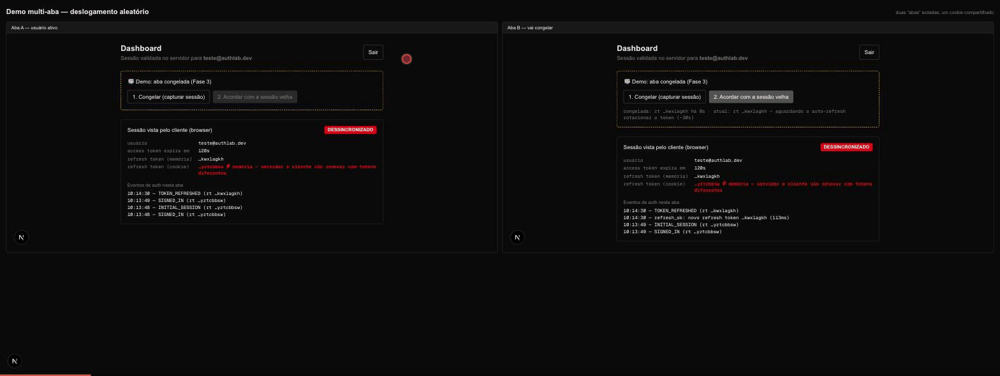

# Fase 4 — A correção

Três camadas, cada uma atacando um elo da cadeia causal confirmada na
Fase 2. Validação automatizada em `scripts/validar-correcao.sh`.

## Camada 1 — `src/proxy.ts`: renovação que persiste (requisito 1)

O único lugar do fluxo SSR autorizado a renovar o token, porque só ali a
escrita de cookie funciona nas duas direções: request reescrito (os RSCs da
própria requisição já enxergam a sessão nova) e `Set-Cookie` na response
(o browser avança junto). Elimina o elo 1 do bug: rotação perdida em RSC.

- Adaptação Next 16: `proxy.ts` com export `proxy` (a doc do Supabase ainda
  ensina `middleware.ts` — mesmo mecanismo, convenção nova).
- **Zero autorização no proxy** (CVE-2025-29927): proteção de rota continua
  no RSC, junto do dado.
- Validado: `refresh_ok` + `cookie_write` no log do proxy, `Set-Cookie` na
  resposta, e **zero** `cookie_write_dropped` (o flagrante das Fases 1–3).

## Camada 2 — guarda de escrita do cookie (requisito 2)

O supabase-js instalado já coordena bastante: single-flight de refresh por
cliente, *commit guard* (descarta tokens rotacionados se o storage mudou
durante o fetch) e BroadcastChannel entre abas. O que ele não impede — e a
Fase 3 filmou — é um ator defasado escrever/apagar o cookie compartilhado.
O browser client agora usa `cookies: { getAll, setAll }` customizados
(`src/lib/supabase/client.ts`):

- **Escrita regressiva bloqueada**: sessão com `expires_at` menor que a do
  cookie não sobrescreve (a aba congelada não regride a sessão das outras).
- **Remoção pelo cliente bloqueada**: no caminho de falha de refresh com AT
  vencido, o auth-js apaga o storage (`_removeSession`) — era isso que
  deslogava todas as abas de uma sessão ainda válida. Logout legítimo é
  Server Action (a remoção vem do servidor e não passa por essa guarda).
- Falha aberta com log quando o valor não é comparável (cookie fatiado).

## Camada 3 — recuperar antes de redirecionar (requisito 3)

- `POST /auth/recover` (Route Handler, pode escrever cookie): `getUser()`
  valida/renova a sessão do cookie. 200 = sessão viva (cookie saneado);
  401 = morta de verdade.
- `SessionRecovery` (client): em `SIGNED_OUT`/falha de refresh, chama o
  recover; se a sessão sobreviveu, reidrata com `setSession` a partir do
  cookie — sem redirect. Só manda para `/login` com a morte confirmada
  pelo servidor (que é o que acontece no logout legítimo). Máximo de 3
  tentativas por minuto para nunca virar loop.
- Fundamento empírico: Fase 2, achado 4 — na maioria desses "logouts" a
  sessão ainda era renovável no GoTrue.

## O que a demo do mundo corrigido mostrou

Mesmo gesto da Fase 3 (aba congela, cadeia avança 2+ rotações, aba acorda
com a sessão velha — agora via `supabase.auth.setSession`, o caminho real
da lib):

1. `cookie_guard: escrita REGRESSIVA bloqueada` no painel — o cookie bom
   sobrevive.
2. Janela de dessincronização em memória (selo DESSINCRONIZADO) enquanto a
   sessão defasada vive só na RAM da aba — com JWT de produção (1h) essa
   janela é irrelevante; no lab (120s) dura até o próximo ciclo.
3. Autocura: os clientes releem o cookie bom e convergem. **Ninguém
   desloga.** Antes, esse gesto derrubava todas as abas.

## Ajuste de ambiente descoberto nesta fase

`jwt_expiry` subiu de 30s para **120s**: o auth-js renova quando faltam
90s (`EXPIRY_MARGIN_MS = 3 × 30s`). Com expiry ≤ 90s, todo token está
permanentemente "para vencer" e cada `getUser()`/`getSession()` dispara
refresh — inclusive o duplo proxy+RSC no mesmo request. Com 120s, token
recém-renovado fica fora da margem e cada requisição faz no máximo um
refresh. Em produção (3600s) a margem de 90s é saudável por natureza.

## Validação (`scripts/validar-correcao.sh`)

1. SSR com token na margem → 200 + `Set-Cookie` com sessão nova (P → C1).
2. SSR com o cookie novo → 200 sem novo refresh.
3. `POST /auth/recover` com cookie são → 200; sem cookie → 401.
4. Semântica do GoTrue intacta (P segue de uso único) — mas nenhum ator
   segura P: o browser recebeu o cookie novo no passo 1.
